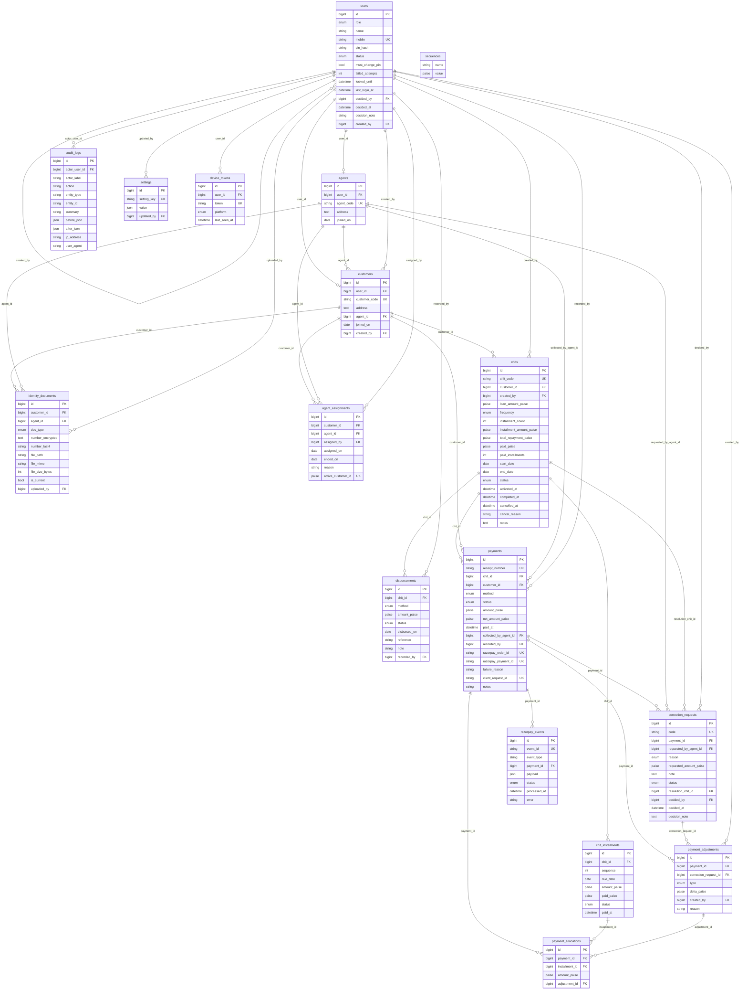

# Thandal – Database Design (Phase 1)

MySQL 8 · InnoDB · utf8mb4. Everything here is generated from one definition file, so the SQL schema, the Laravel migrations and this document cannot disagree.

## 1. Design rules

1. **Money is stored as whole paise** in unsigned/signed `BIGINT` columns named `*_paise`. No decimals, no rounding errors. The apps show rupees only.
2. **Financial rows are never deleted.** Every foreign key is `ON DELETE RESTRICT`. Fixes are new rows (adjustments, reversals), not edits.
3. **The database enforces the important rules itself**, not only the application: unique mobile numbers, unique receipt numbers, unique Razorpay ids, one webhook event once, `total = installment × count`, an installment can never be over-paid, payments must be > 0, an ID proof belongs to exactly one person, a customer has at most one current agent.
4. **Cached totals** (`chits.paid_paise`, `chits.paid_installments`) exist for fast lists. They are updated in the **same transaction** as the payment, with the chit row locked.
5. **Overdue is not stored.** It is `due_date < today (IST)` and not fully paid, so it can never go stale.
6. **All times are India time (IST).** Laravel `app.timezone = Asia/Kolkata`, MySQL session time zone `+05:30`.

## 2. How the pieces connect

- `users` is the login for everyone. `agents` and `customers` are profiles that point to a user.
- `customers.agent_id` is the **current** agent. `agent_assignments` keeps the full history. `active_customer_id` is a marker that equals the customer id while the row is current and is `NULL` afterwards; a unique index on it guarantees **one current agent per customer** (MySQL has no partial unique index).
- `chits` → `chit_installments` (the schedule) → `payment_allocations` ← `payments`. A payment is spread over installments through allocation rows.
- `payment_allocations.amount_paise` is **signed**. A reversal adds negative rows linked to a `payment_adjustments` row. The current state is always the sum of the rows.
- `payments.net_amount_paise` caches the amount after approved corrections. `NULL` means unchanged, so *effective amount = COALESCE(net_amount_paise, amount_paise)*.
- `correction_requests` → `payment_adjustments`: an approved request creates an adjustment; nothing else is touched.
- `razorpay_events.event_id` is unique: a repeated webhook cannot be processed twice. `payments.razorpay_order_id` and `razorpay_payment_id` are unique too.
- `payments.client_request_id` is unique: the app sends one per collection, so a double tap or retry cannot create two payments.
- `sequences` hands out receipt, customer, chit, agent and correction numbers under a row lock (`SELECT … FOR UPDATE`), so numbers never repeat or skip.
- `identity_documents` holds the ID proof of a customer **or** an agent (a database check forces exactly one). The number is encrypted by the application; only the last 4 digits are stored in clear.
- `audit_logs` is append-only (no `updated_at`).

## 3. ER diagram

The same diagram as a picture is in `er-diagram.html`. Source below.

## 4. Tables

### `users`
Login identity for every role. Mobile number + hashed 4-digit PIN. Admin self-registrations are rows with role=admin and status=pending until a super admin approves.

| Column | Type | Null | Notes |
|---|---|---|---|
| `id` | bigint | no | primary key |
| `role` | one of: customer, agent, admin, super_admin | no |  |
| `name` | string(120) | no |  |
| `mobile` | char(10) | no | 10 digits, unique across all roles; unique |
| `pin_hash` | string(255) | no | bcrypt hash, never the PIN |
| `status` | one of: pending, active, inactive, rejected | no | default active |
| `must_change_pin` | yes/no | no | 1 after an admin resets the PIN (temporary PIN); default 0 |
| `failed_attempts` | tiny int | no | default 0 |
| `locked_until` | datetime | yes | set after 3 wrong PINs, 15 minutes |
| `last_login_at` | datetime | yes |  |
| `decided_by` | → users | yes |  |
| `decided_at` | datetime | yes | admin registration decision |
| `decision_note` | string(255) | yes |  |
| `created_by` | → users | yes |  |

### `agents`
Agent profile.

| Column | Type | Null | Notes |
|---|---|---|---|
| `id` | bigint | no | primary key |
| `user_id` | → users | no | unique |
| `agent_code` | string(20) | no | AGT-007; unique |
| `address` | text | no |  |
| `joined_on` | date | no |  |

### `customers`
Customer profile. agent_id is the CURRENT agent (history lives in agent_assignments).

| Column | Type | Null | Notes |
|---|---|---|---|
| `id` | bigint | no | primary key |
| `user_id` | → users | no | unique |
| `customer_code` | string(20) | no | THD-10245; unique |
| `address` | text | no |  |
| `agent_id` | → agents | yes |  |
| `joined_on` | date | no |  |
| `created_by` | → users | no |  |

### `identity_documents`
ID proof of a customer or an agent (any one type). Number is encrypted, file is in private storage.

| Column | Type | Null | Notes |
|---|---|---|---|
| `id` | bigint | no | primary key |
| `customer_id` | → customers | yes |  |
| `agent_id` | → agents | yes |  |
| `doc_type` | one of: aadhaar_card, pan_card, voter_id, driving_licence, passport, ration_card | no |  |
| `number_encrypted` | text | no | Laravel Crypt, never shown in full |
| `number_last4` | char(4) | no |  |
| `file_path` | string(255) | no | private disk path |
| `file_mime` | string(60) | no |  |
| `file_size_bytes` | int | no |  |
| `is_current` | yes/no | no | default 1 |
| `uploaded_by` | → users | no |  |
| _rule_ | `(customer_id IS NULL) <> (agent_id IS NULL)` | | enforced by the database (`chk_identity_owner`) |

### `agent_assignments`
Who looked after a customer and when. Past rows are never edited.

| Column | Type | Null | Notes |
|---|---|---|---|
| `id` | bigint | no | primary key |
| `customer_id` | → customers | no |  |
| `agent_id` | → agents | no |  |
| `assigned_by` | → users | no |  |
| `assigned_on` | date | no |  |
| `ended_on` | date | yes |  |
| `reason` | string(120) | yes |  |
| `active_customer_id` | paise (unsigned) | yes | = customer_id while current, NULL after. Unique => one current agent per customer; unique |

### `chits`
A loan and its repayment plan. Total = installment x count. Created Pending; Active after a completed disbursement.

| Column | Type | Null | Notes |
|---|---|---|---|
| `id` | bigint | no | primary key |
| `chit_code` | string(20) | no | THD-1001; unique |
| `customer_id` | → customers | no |  |
| `created_by` | → users | no |  |
| `loan_amount_paise` | paise (unsigned) | no | amount given to the customer |
| `frequency` | one of: daily, weekly, monthly | no |  |
| `installment_count` | small int | no |  |
| `installment_amount_paise` | paise (unsigned) | no | set by the admin/agent |
| `total_repayment_paise` | paise (unsigned) | no | = installment_count x installment_amount_paise |
| `paid_paise` | paise (unsigned) | no | cache, kept in the same transaction as payments; default 0 |
| `paid_installments` | small int | no | cache; default 0 |
| `start_date` | date | no | first installment is due on this date |
| `end_date` | date | no |  |
| `status` | one of: pending, active, completed, cancelled | no | default pending |
| `activated_at` | datetime | yes |  |
| `completed_at` | datetime | yes |  |
| `cancelled_at` | datetime | yes |  |
| `cancel_reason` | string(255) | yes |  |
| `notes` | text | yes |  |
| _rule_ | `installment_count > 0` | | enforced by the database (`chk_chits_count`) |
| _rule_ | `installment_amount_paise > 0` | | enforced by the database (`chk_chits_amount`) |
| _rule_ | `total_repayment_paise = installment_count * installment_amount_paise` | | enforced by the database (`chk_chits_total`) |
| _rule_ | `paid_paise <= total_repayment_paise` | | enforced by the database (`chk_chits_paid`) |

### `chit_installments`
The repayment schedule, one row per due date. "Overdue" is derived: due_date < today (IST) and not paid.

| Column | Type | Null | Notes |
|---|---|---|---|
| `id` | bigint | no | primary key |
| `chit_id` | → chits | no |  |
| `sequence` | small int | no |  |
| `due_date` | date | no |  |
| `amount_paise` | paise (unsigned) | no |  |
| `paid_paise` | paise (unsigned) | no | default 0 |
| `status` | one of: upcoming, partially_paid, paid, cancelled | no | default upcoming |
| `paid_at` | datetime | yes |  |
| _rule_ | `paid_paise <= amount_paise` | | enforced by the database (`chk_inst_paid`) |

### `disbursements`
Loan amount given to the customer (cash or bank transfer). A failed attempt leaves the chit Pending.

| Column | Type | Null | Notes |
|---|---|---|---|
| `id` | bigint | no | primary key |
| `chit_id` | → chits | no |  |
| `method` | one of: cash, bank_transfer | yes |  |
| `amount_paise` | paise (unsigned) | no |  |
| `status` | one of: pending, completed, failed | no | default pending |
| `disbursed_on` | date | yes |  |
| `reference` | string(60) | yes | required for bank transfer |
| `note` | string(255) | yes |  |
| `recorded_by` | → users | yes |  |

### `payments`
One row per money received. Confirmed rows are immutable: fixes are made with payment_adjustments.

| Column | Type | Null | Notes |
|---|---|---|---|
| `id` | bigint | no | primary key |
| `receipt_number` | string(24) | yes | THD-RCP-000231, given when confirmed; unique |
| `chit_id` | → chits | no |  |
| `customer_id` | → customers | no |  |
| `method` | one of: cash, online | no |  |
| `status` | one of: pending, confirmed, failed, reversed | no |  |
| `amount_paise` | paise (unsigned) | no | amount as first recorded |
| `net_amount_paise` | paise (unsigned) | yes | amount after approved corrections; NULL = unchanged (effective = COALESCE(net, amount)) |
| `paid_at` | datetime | yes |  |
| `collected_by_agent_id` | → agents | yes |  |
| `recorded_by` | → users | yes |  |
| `razorpay_order_id` | string(40) | yes | unique |
| `razorpay_payment_id` | string(40) | yes | unique |
| `failure_reason` | string(255) | yes |  |
| `client_request_id` | string(64) | yes | sent by the app; blocks double taps and repeat submits; unique |
| `notes` | string(255) | yes |  |
| _rule_ | `amount_paise > 0` | | enforced by the database (`chk_pay_amount`) |

### `correction_requests`
Agent asks the admin to fix a confirmed payment.

| Column | Type | Null | Notes |
|---|---|---|---|
| `id` | bigint | no | primary key |
| `code` | string(20) | no | CR-041; unique |
| `payment_id` | → payments | no |  |
| `requested_by_agent_id` | → agents | no |  |
| `reason` | one of: wrong_amount, wrong_customer_or_chit, duplicate_entry, other | no |  |
| `requested_amount_paise` | paise (unsigned) | yes |  |
| `note` | text | no |  |
| `status` | one of: pending, approved, rejected | no | default pending |
| `resolution_chit_id` | → chits | yes |  |
| `decided_by` | → users | yes |  |
| `decided_at` | datetime | yes |  |
| `decision_note` | text | yes |  |

### `payment_adjustments`
Append-only record of every correction applied to a payment (nothing is deleted).

| Column | Type | Null | Notes |
|---|---|---|---|
| `id` | bigint | no | primary key |
| `payment_id` | → payments | no |  |
| `correction_request_id` | → correction_requests | yes |  |
| `type` | one of: amount_change, reversal, moved_to_other_chit | no |  |
| `delta_paise` | paise (signed) | no | signed change to the payment amount |
| `created_by` | → users | no |  |
| `reason` | string(255) | no |  |

### `payment_allocations`
How a payment was applied to installments. Signed: reversals are negative rows linked to an adjustment.

| Column | Type | Null | Notes |
|---|---|---|---|
| `id` | bigint | no | primary key |
| `payment_id` | → payments | no |  |
| `installment_id` | → chit_installments | no |  |
| `amount_paise` | paise (signed) | no |  |
| `adjustment_id` | → payment_adjustments | yes |  |

### `razorpay_events`
Every Razorpay webhook received. event_id is unique so a repeated webhook is processed once.

| Column | Type | Null | Notes |
|---|---|---|---|
| `id` | bigint | no | primary key |
| `event_id` | string(64) | no | unique |
| `event_type` | string(60) | no |  |
| `payment_id` | → payments | yes |  |
| `payload` | json | no |  |
| `status` | one of: received, processed, ignored, failed | no | default received |
| `processed_at` | datetime | yes |  |
| `error` | string(255) | yes |  |

### `audit_logs`
Who did what and when. Append-only.

| Column | Type | Null | Notes |
|---|---|---|---|
| `id` | bigint | no | primary key |
| `actor_user_id` | → users | yes |  |
| `actor_label` | string(120) | no |  |
| `action` | string(80) | no |  |
| `entity_type` | string(40) | no |  |
| `entity_id` | string(40) | no |  |
| `summary` | string(500) | no |  |
| `before_json` | json | yes |  |
| `after_json` | json | yes |  |
| `ip_address` | string(45) | yes |  |
| `user_agent` | string(255) | yes |  |

### `sequences`
Gap-free counters for receipt numbers and codes (locked with SELECT ... FOR UPDATE).

| Column | Type | Null | Notes |
|---|---|---|---|
| `name` | string(40) | no |  |
| `value` | paise (unsigned) | no | default 0 |

### `settings`
Admin-editable settings (support phone, PIN rules, Razorpay mode, ...).

| Column | Type | Null | Notes |
|---|---|---|---|
| `id` | bigint | no | primary key |
| `setting_key` | string(80) | no | unique |
| `value` | json | no |  |
| `updated_by` | → users | yes |  |

### `device_tokens`
Push notification tokens. Push is not used in V1; the table keeps the architecture ready.

| Column | Type | Null | Notes |
|---|---|---|---|
| `id` | bigint | no | primary key |
| `user_id` | → users | no |  |
| `token` | string(255) | no | unique |
| `platform` | one of: android, ios | no |  |
| `last_seen_at` | datetime | yes |  |

### Framework tables
`personal_access_tokens` (Laravel Sanctum, mobile API tokens) and `sessions` (admin web sessions) use the standard Laravel structure.

## 5. Indexes (why they exist)
| Index | Serves |
|---|---|
| `chit_installments (due_date, status)` | "Today's expected / overdue" lists and reports |
| `chit_installments (chit_id, status)` | Next installment and outstanding for one chit |
| `payments (collected_by_agent_id, paid_at)` | Agent history and daily totals |
| `payments (customer_id, paid_at)` / `(chit_id, paid_at)` | Customer statement and chit payments |
| `payments (status, paid_at)` | Pending/failed payment lists and reconciliation |
| `chits (customer_id, status)` | A customer's active and past chits |
| `customers (agent_id)` | "Assigned customers" of an agent |
| `audit_logs (entity_type, entity_id)` | Audit tab on a customer, chit or payment |

## 6. What was verified

The generated `schema.sql` was loaded into a real database server and **21 rule checks passed**: duplicate mobile numbers, wrong chit totals, over-paid installments, duplicate installment numbers, zero payments, duplicate receipt numbers, double submits, repeated Razorpay ids, repeated webhook events, ID proof with no or two owners, two current agents, transfer keeping history, and deletes being blocked for customers, chits and payments with related records. All 19 migration files pass a PHP syntax check.

**Not yet verified:** the migrations were not run by Laravel itself (Laravel is not installed in the build environment). Run `php artisan migrate` once in your environment; it should create the same tables. If anything differs, tell me and I will fix the generator.

## 7. Files
| File | What |
|---|---|
| `backend/database/schema.sql` | Full MySQL schema (load this to see the structure) |
| `backend/database/migrations/` | The same schema as 19 Laravel migrations, in dependency order |
| `backend/database/tests/verify_schema.sh` | The 21 checks (needs a MySQL/MariaDB server) |
| `docs/er-diagram.mmd` / `er-diagram.html` | ER diagram source / viewer |
